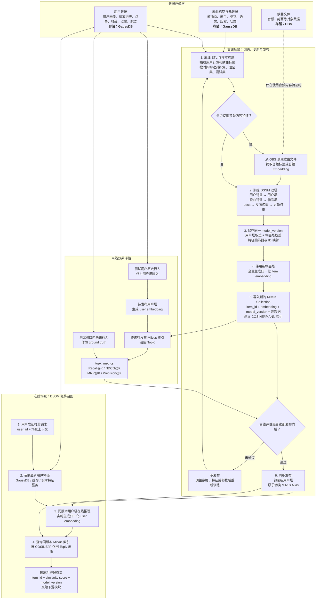

# DSSM 音乐推荐流程

本流程描述用户数据、歌曲标签和歌曲文件的存储位置，以及 DSSM 粗排模型的离线训练、模型更新、离线评估和在线召回过程。

## 核心原则

1. Milvus 存储的是歌曲 `item embedding` 及其元数据，不存储 OBS 中的歌曲文件。
2. 用户 `user embedding` 在线实时生成，也可以按 `user_id` 缓存，但通常不需要建立用户向量索引。
3. 用户塔与 Milvus 中的物品向量必须来自同一个 `model_version`。
4. 即使模型结构不变，只要物品塔、共享 Embedding 或相关权重发生变化，就需要全量刷新 `item embedding` 并重建索引。
5. `topk_metrics` 仅用于离线召回效果评估，不参与模型训练，也不在在线粗排请求中实时计算。
6. 在线 DSSM 服务到输出 TopN 粗排候选集为止，过滤、精排和最终用户响应属于下游流程。
